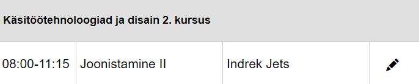

# Tunniplaani kasutajaliidese kasutusjuhend

## Avakuva
Tunniplaani avamisel kuvatakse avaekraan. Päises on sisselogimisenupup, vasakul filtrid ning põhiosas kuvatakse lähipäevade tunniplaan. Allapoole kerides kuvatakse järjest tulevate päevade tunniplaan.

Mobiilivaates on avakuva sarnane, kuid ei kuvata vasakul olevat filtripaneeli ning päises on menüü valikute asemel filtripaneeli ikoon ja menüü hamburgeriikoon.

Tunniplaanis õppeainel klõpsates avaneb õppeinfo vaade.

## Filtrid
Ekraani vasakul osas on filtrite paneel. Filtrit saab kasutada kuvatava tunniplaani täpsustamiseks.

Mobiilivaates kuvatakse filtripaneeli avamise nupp lehekülje päises.

Filtrit saab seada avades filtrivälja rippmenüü.

Filtriväljas valikutel klõpsates lisatakse vastav valik filtrisse. Filtrisse saab lisada mitu valikut, korrates sama protseduuri. 

Kuna mobiilivaates pole tunniplaani sirvimisel filtripaneeli näha, siis kuvatakse filtriikoonil seatud filtrite arv:

Täpselt samut saab seada filtrit kõikidele teistele väljadele: õppeainele, õppejõule ja ruumile.

Kuupäevade filtri seadmiseks tuleb avada kuupäeva filter - Kalender. Tavaliselt on see avatud olekus, kuid seda on võimalik sulgeda noolekesega üles nuppu kasutades. 

Kalendri ülaosas on kirjutatud valitud kuu ja aasta ning seda on võimalik edasi või tagasi kerida, kasutades kuu ja aasta väljast vasakul ja paremal olevaid noolekesi. Klõpsates kuu ja aasta väljal, saab muuta otsimisrežiimi kuudeks, aastateks ja dekaadideks. Kuupäeva valimiseks tuleb kalendris klõpsata perioodi alguse ja seejärel soovitud perioodi lõpu kuupäeval.

Filtreid saab kustutada kas üksikute filtrite paremal asuvate ristikestega, või filtripaneeli all oleva tühjenda nupuga.

## Sisse- ja välja logimine
Sisselogimiseks on vajalik kooli poolt antud Google konto. Sisselogimist saab alustada päises paremal asuval sisselogimise nupul:

Mobiilivaates saab sisselogimise nupu avada hamburgerimenüüst 

Sisselogimise nupule vajutades avaneb Google sisselogimise aken

Väljalogimiseks tuleb vajutada päises paremal nurgas asuvale Google konto ikoonile, misjärel avaneb väljalogimise kinnitusaken

Mobiilivaates avaneb sisselogimispaneeliga sarnane väljalogimispaneel, kus "Logi välja" nupule vajutades avaneb kinnitusaken

## Tunniplaani redigeerimine
**Tunniplaani saab redigeerida vaid vastavate õigustega kasutaja. Kõik järgnev on kättesaadav vaid sellistele kasutajatele.**

Tunniplaani uue loengu sisestamiseks tuleb klõpsata filtripaneeli kohal olevale LISA nupule

Mobiilivaates on loengu lisamiseks + ikoon:

Avaneb loengu lisamise dialoog:

Mobiilivaates on dialoog sarnave, vaid väljad on asetsevad üksteise all. Rippmenüüdest saab valida vajalikud õppained, õppejõud, kursused ning klassiruumid. Igal loengul võib olla mitu kursust, õppeainet ning õppejõudu. 

Loengu sisestamiseks tuleb etta anda kuupäev, loengu maht (akadeemilistes) tundides ning lõunapausi olemasolu. Selle alusel arvestatakse loengu lõpu kellaaeg. Alates 5 tunnist lisatakse automaatselt lõunapaus valik, kuid seda on võimalik muuta.

Samas on võimalik dialoogi loengu andmete järel olevat plussi vajutades lisada samade andmetega, kuid teistel aegadel toimuvad loengud.

Salvestamiseks tuleb vajutada SALVESTA nuppu ning tühistamiseks tunniplaani lisamise akna ülemises paremas nurgas olevat ristikest.

Tunniplaani vaates hiirekursori loegu kohale asetades ilmub loengu paremasse serva pliiatsikujuline redigeerimisikoon. Mobiilivaates on need ikoonid kogu aeg nähtaval.

Sellel ikoonil klõpsates ilmub täpselt samasugune sisestusaken nagu uue loengu sisestamisel.

## Loengute/õppejõudude/ruumide redigeerimine

## Kodutööde lisamine
Kodutööde lisamiseks tunniplaanis tuleb avada tunniplaani vaatest loeng. Selleks ei tule klõpsata mitte paremal asuval pliiatsil, vaid loengu nimel. Avaneb õppeinfo vaade. Kui kasutajal on õigus töid lisada, ilmub õppeinfo vaate paremasse nurka pliiatsikujuline ikoon.

Pliiatsil klõpsates avaneb õppeinfo muutmise dialoog.

Dialoogi sulgemiseks salvestamata, tuleb klõpsata üleval paremas nurgas oleval ristikesel. Salvestamiseks vajutada SALVESTA nuppu.

Iseseisva töö lisamiseks tuleb täita dialoogi vormil olevad väljad. Uue rea lisamiseks tuleb vajutada paremal olevale + märgile.

Kui vajalik info on sisestatud, siis vajutades salvesta nuppu ilmub järgmine dialoog

## Probleemid, mis on veel lahendamata
- Kui avada tunni menüü ning muuta õppeaine nime, siis salvestamisel hangub - ette jääb andmete laadimist tähistav rõngake. Kui seda ignoreerida ning teha refresh, siis andmete laadimine ebaõnnestub. Järelikult juhtub midagi andmebaasiga.
- Koduse töö salvestamine tunniplaanis ei õnnestu.

